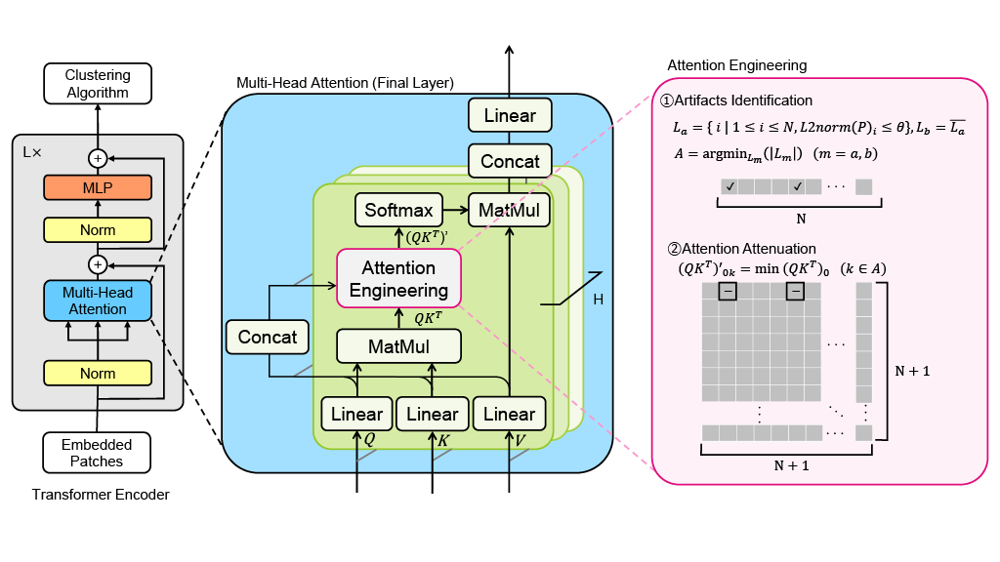
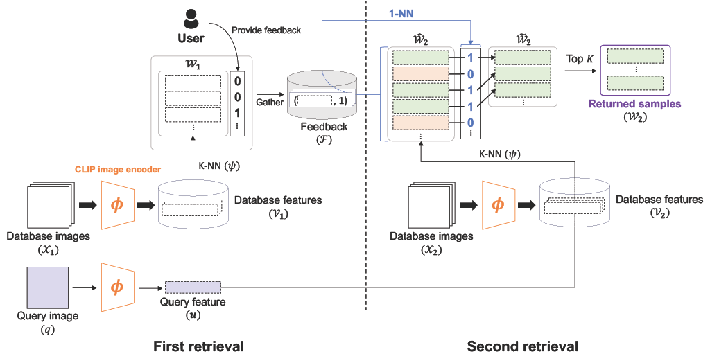
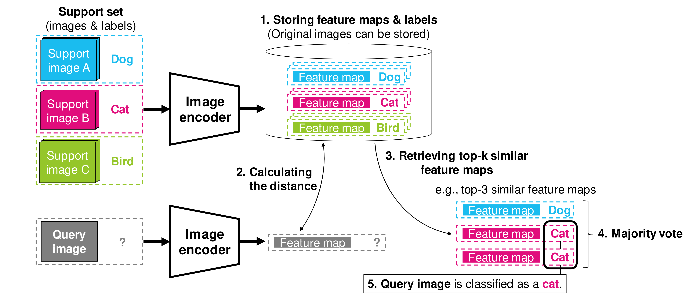
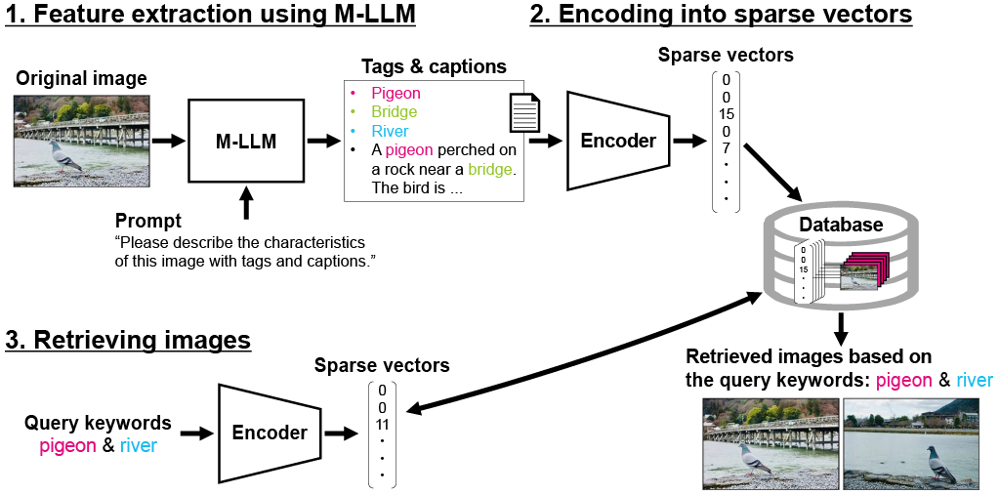
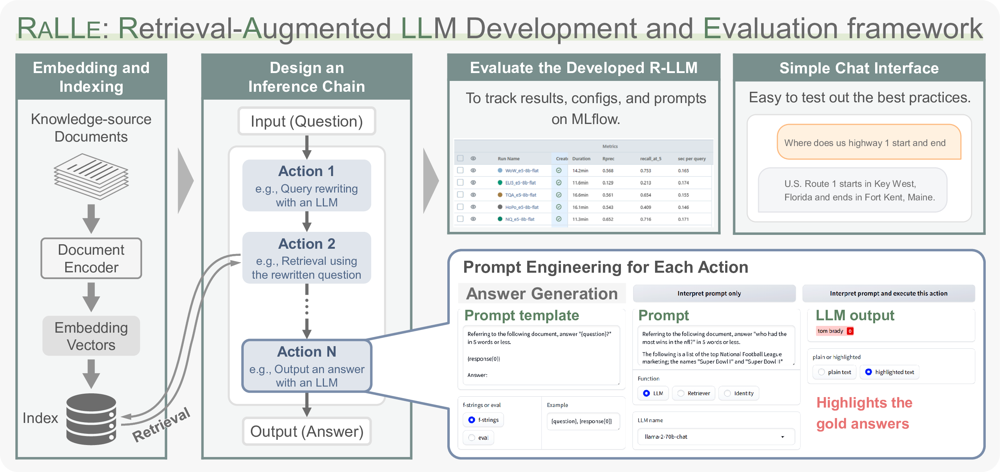
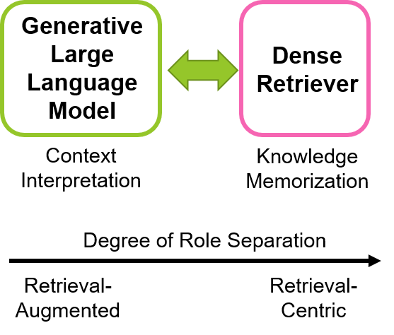

Hi I'm Youyang. I am an experienced industrial researcher focusing on basic and applied studies in Computer Vision, Natural Language Processing, Machine Learning, and Memory Systems, with track record in patents, publications, and industrial implementations. Currently, I lead a deep learning research team at Kioxia Corporation, Japan. My research interests lie in the intersection of memory, intelligence, and alignment in vision and language models.

I have co-authored over 30 patents and research articles, including publications in notable venues such as ECCV, ACCV and EMNLP. Additionally, I have served as a reviewer for venues including ACL Rolling Review, ICCV, WACV, BMVC, ACL, EMNLP and NAACL. I have received outstanding reviewer recognition at EMNLP. I am also a Senior Member of IEEE. I have over 14 years of industrial R&D experiences, including roles at Kioxia and Toshiba Corporation, and hold a B.Eng from Universiti Malaya, Malaysia. The tools I help develop inspect and analyze millions of visual data daily in social infrastructure & semiconductor industries. I speak English, Japanese, Chinese and Malay.

[Google Scholar](https://scholar.google.com/citations?user=4BGLw_QAAAAJ) &nbsp;&nbsp; [LinkedIn](https://www.linkedin.com/in/youyang-ng-55a10ab9/) &nbsp;&nbsp; [Publications List](publications.md)

Selected Works
======
## Aligning Human-AI Perception in Vision Foundation Models

**Prompt-Guided Attention Head Selection for Focus-Oriented Image Retrieval**  
Yuji Nozawa, Yu-Chieh Lin, Kazumoto Nakamura, <ins>Youyang Ng</ins>  
*IEEE/CVF Conference on Computer Vision and Pattern Recognition (CVPR) Workshops, 2025 ([paper](https://arxiv.org/abs/2504.01348))*

**Improving Image Clustering with Artifacts Attenuation via Inference-Time Attention Engineering**  
Kazumoto Nakamura, Yuji Nozawa, Yu-Chieh Lin, Kengo Nakata, <ins>Youyang Ng</ins>  
*Asian Conference on Computer Vision (ACCV), 2024 ([paper](https://openaccess.thecvf.com/content/ACCV2024/html/Nakamura_Improving_Image_Clustering_with_Artifacts_Attenuation_via_Inference-Time_Attention_Engineering_ACCV_2024_paper.html))*

**Revisiting Relevance Feedback for CLIP-based Interactive Image Retrieval**  
Ryoya Nara, Yu-Chieh Lin, Yuji Nozawa, <ins>Youyang Ng</ins>, Goh Itoh, Osamu Torii, Yusuke Matsui  
*European Conference on Computer Vision (ECCV) Workshops, 2024 ([paper](https://arxiv.org/abs/2404.16398), [blog](https://www.kioxia.com/en-jp/rd/technology/topics/topics-79.html))*

## Rethinking Vision Models with Separable, Explainable & Editable Knowledge

**Revisiting a kNN-based Image Classification System with High-capacity Storage**  
Kengo Nakata, <ins>Youyang Ng</ins>, Daisuke Miyashita, Asuka Maki, Yu-Chieh Lin, Jun Deguchi  
*European Conference on Computer Vision (ECCV), 2022, **Oral Acceptance - Top 2.7%** ([paper](https://arxiv.org/abs/2204.01186), [press](https://www.kioxia.com/en-jp/about/news/2022/20221102-1.html), [blog](https://www.kioxia.com/en-jp/rd/technology/topics/topics-39.html))*

**Rethinking Sparse Lexical Representations for Image Retrieval in the Age of Rising Multi-Modal Large Language Models**  
Kengo Nakata, Daisuke Miyashita, <ins>Youyang Ng</ins>, Yasuto Hoshi, Jun Deguchi  
*European Conference on Computer Vision (ECCV) Workshops, 2024 ([paper](https://arxiv.org/abs/2408.16296), [blog](https://www.kioxia.com/en-jp/rd/technology/topics/topics-76.html))*

## Language Models with Retrieval-Augmented & Retrieval-Centric Generation

**RaLLe: A Framework for Developing and Evaluating Retrieval-Augmented Large Language Models**  
Yasuto Hoshi, Daisuke Miyashita, <ins>Youyang Ng</ins>, Kento Tatsuno, Yasuhiro Morioka, Osamu Torii, Jun Deguchi  
*Conference on Empirical Methods in Natural Language Processing (EMNLP) System Demonstrations, 2023 ([paper](https://arxiv.org/abs/2308.10633), [code](https://github.com/yhoshi3/RaLLe), [blog](https://www.kioxia.com/en-jp/rd/technology/topics/topics-58.html))*

**SimplyRetrieve: A Private and Lightweight Retrieval-Centric Generative AI Tool**  
<ins>Youyang Ng</ins>, Daisuke Miyashita, Yasuto Hoshi, Yasuhiro Morioka, Osamu Torii, Tomoya Kodama, Jun Deguchi  
*arXiv, 2023 ([paper](https://arxiv.org/abs/2308.03983), [code](https://github.com/RCGAI/SimplyRetrieve), [blog](https://www.kioxia.com/en-jp/rd/technology/topics/topics-58.html))*

