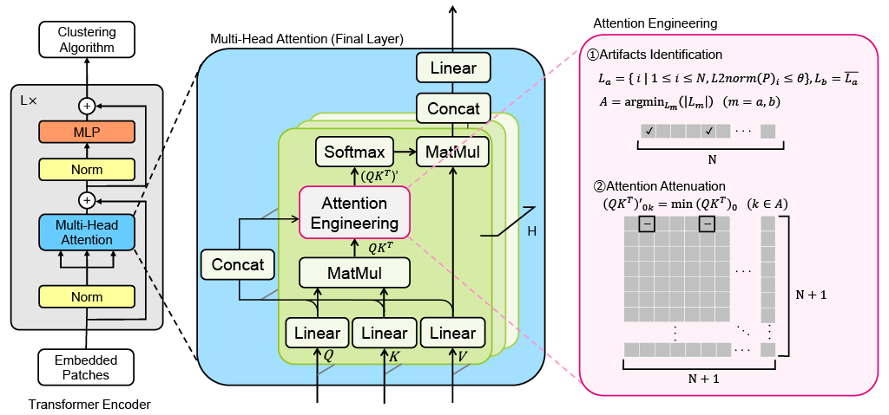

Hi I'm Youyang. I am currently a researcher and team leader at the research lab of Kioxia Corporation, Japan. My main research focuses are basic & applied research in Computer Vision, Machine Learning, Natural Language Processing and Memory System. I am particularly interested in the intersection of memory, intelligence, and alignment in vision and language models. 

I have co-authored over 30 patents and research articles including publications at ECCV, ACCV, EMNLP and others. I have been serving as a reviewer at ACL Rolling Review, WACV, ACL, EMNLP and others. I have received outstanding reviewer recognition at EMNLP. I am also a Senior Member of IEEE. I have over 14 years of industrial R&D experiences, previously worked at Toshiba Corporation, and hold a B.Eng from Universiti Malaya, Malaysia. I speak English, Japanese, Chinese and Malay.

[Google Scholar](https://scholar.google.com/citations?user=4BGLw_QAAAAJ) &nbsp;&nbsp; [LinkedIn](https://www.linkedin.com/in/youyang-ng-55a10ab9/) &nbsp;&nbsp; [X](https://x.com/youyang_ng) &nbsp;&nbsp; [Github](https://github.com/rcgai)

Selected Works
======
## Boosting ViT with Inference-Time Attention Engineering (ITAE)

**Improving Image Clustering with Artifacts Attenuation via Inference-Time Attention Engineering**  
Kazumoto Nakamura, Yuji Nozawa, Yu-Chieh Lin, Kengo Nakata, Youyang Ng  
*Asian Conference on Computer Vision (ACCV), 2024 ([paper](https://openaccess.thecvf.com/content/ACCV2024/html/Nakamura_Improving_Image_Clustering_with_Artifacts_Attenuation_via_Inference-Time_Attention_Engineering_ACCV_2024_paper.html))*

## Boosting Vision Models with Relevance Feedback for Image Retrieval

**Revisiting Relevance Feedback for CLIP-based Interactive Image Retrieval**  
Ryoya Nara, Yu-Chieh Lin, Yuji Nozawa, Youyang Ng, Goh Itoh, Osamu Torii, Yusuke Matsui  
*European Conference on Computer Vision (ECCV) Workshops, 2024 ([paper](https://arxiv.org/abs/2404.16398))*

## Explainable Image Retrieval with Large Vision-Language Models

**Rethinking Sparse Lexical Representations for Image Retrieval in the Age of Rising Multi-Modal Large Language Models**  
Kengo Nakata, Daisuke Miyashita, Youyang Ng, Yasuto Hoshi, Jun Deguchi  
*European Conference on Computer Vision (ECCV) Workshops, 2024 ([paper](https://arxiv.org/abs/2408.16296), [blog](https://www.kioxia.com/en-jp/rd/technology/topics/topics-76.html))*

## Flexible RAG Development Platform

**RaLLe: A Framework for Developing and Evaluating Retrieval-Augmented Large Language Models**  
Yasuto Hoshi, Daisuke Miyashita, Youyang Ng, Kento Tatsuno, Yasuhiro Morioka, Osamu Torii, Jun Deguchi  
*Conference on Empirical Methods in Natural Language Processing (EMNLP) System Demonstrations, 2023 ([paper](https://arxiv.org/abs/2308.10633), [code](https://github.com/yhoshi3/RaLLe), [blog](https://www.kioxia.com/en-jp/rd/technology/topics/topics-58.html))*

## Retrieval-Centric Generation (RCG)

**SimplyRetrieve: A Private and Lightweight Retrieval-Centric Generative AI Tool**  
Youyang Ng, Daisuke Miyashita, Yasuto Hoshi, Yasuhiro Morioka, Osamu Torii, Tomoya Kodama, Jun Deguchi  
*arXiv, 2023 ([paper](https://arxiv.org/abs/2308.03983), [code](https://github.com/RCGAI/SimplyRetrieve), [blog](https://www.kioxia.com/en-jp/rd/technology/topics/topics-58.html))*

## Rethinking Image Classification with Explainable & Editable Knowledge

**Revisiting a kNN-based Image Classification System with High-capacity Storage**  
Kengo Nakata, Youyang Ng, Daisuke Miyashita, Asuka Maki, Yu-Chieh Lin, Jun Deguchi  
*European Conference on Computer Vision (ECCV), 2022, **Oral** ([paper](https://arxiv.org/abs/2204.01186), [press](https://www.kioxia.com/en-jp/about/news/2022/20221102-1.html), [blog](https://www.kioxia.com/en-jp/rd/technology/topics/topics-39.html))*

