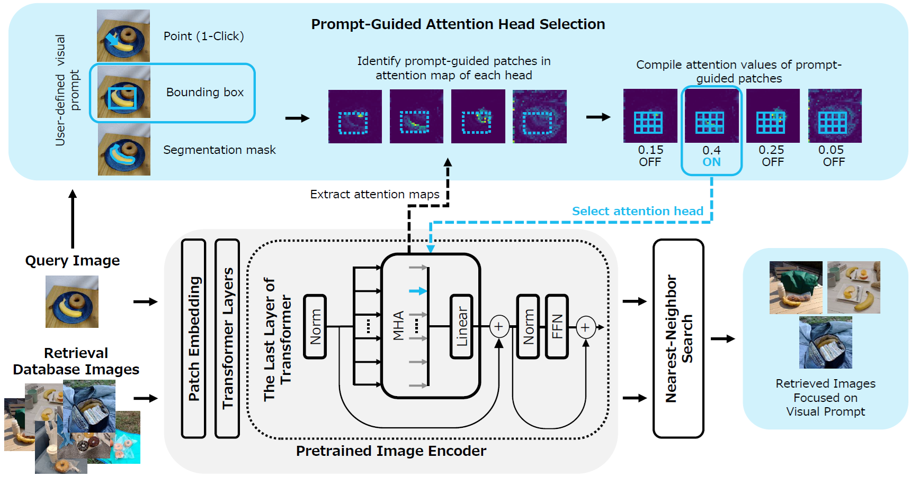

Hi I'm Youyang. I am an experienced industry researcher focusing on basic and applied studies in Computer Vision, Natural Language Processing, Machine Learning, and Memory System, with track record in patents, publications, and industrial implementations. Currently, I lead a deep learning research team at Kioxia Corporation, Japan. My research interests lie in the intersection and interaction of memory, intelligence, and perception in vision and language models.

I have co-authored over 40 patents and research articles, including publications in notable venues such as ECCV, ACCV and EMNLP. Additionally, I have served as a reviewer for venues including ACL Rolling Review, ICCV, WACV, BMVC, ACL, EMNLP and NAACL. I have received outstanding reviewer recognition at EMNLP. I am also a Senior Member of IEEE. I have over 14 years of industrial R&D experiences, including roles at Kioxia and Toshiba Corporation in Japan, and hold a B.Eng from Universiti Malaya, Malaysia. The tools I helped develop inspect and analyze millions of visual data daily in social infrastructure & semiconductor industries. I speak English, Japanese, Chinese and Malay.

[Google Scholar](https://scholar.google.com/citations?user=4BGLw_QAAAAJ) &nbsp;&nbsp; [LinkedIn](https://www.linkedin.com/in/youyang-ng-55a10ab9/) &nbsp;&nbsp; [Publications](publications.md) &nbsp;&nbsp; [Services](#services) &nbsp;&nbsp; [Recognitions](#recognitions)

# AI & Machine Learning Algorithm R&D Tips
* [Setting up machine learning development environment on AWS EC2](https://github.com/yy29/aws-ec2-tips-llm-chat-ai)

# Selected Works

### Aligning Human-AI Perception in Vision Foundation Models

**Prompt-Guided Attention Head Selection for Focus-Oriented Image Retrieval**  
Yuji Nozawa, Yu-Chieh Lin, Kazumoto Nakamura, <ins>Youyang Ng</ins>  
*IEEE/CVF Conference on Computer Vision and Pattern Recognition (CVPR) Workshops, 2025 ([paper](https://openaccess.thecvf.com/content/CVPR2025W/PixFoundation/html/Nozawa_Prompt-Guided_Attention_Head_Selection_for_Focus-Oriented_Image_Retrieval_CVPRW_2025_paper.html))*

**Improving Image Clustering with Artifacts Attenuation via Inference-Time Attention Engineering**  
Kazumoto Nakamura, Yuji Nozawa, Yu-Chieh Lin, Kengo Nakata, <ins>Youyang Ng</ins>  
*Asian Conference on Computer Vision (ACCV), 2024 ([paper](https://openaccess.thecvf.com/content/ACCV2024/html/Nakamura_Improving_Image_Clustering_with_Artifacts_Attenuation_via_Inference-Time_Attention_Engineering_ACCV_2024_paper.html), [blog](https://www.kioxia.com/en-jp/rd/technology/topics/topics-84.html))*

**Revisiting Relevance Feedback for CLIP-based Interactive Image Retrieval**  
Ryoya Nara, Yu-Chieh Lin, Yuji Nozawa, <ins>Youyang Ng</ins>, Goh Itoh, Osamu Torii, Yusuke Matsui  
*European Conference on Computer Vision (ECCV) Workshops, 2024 ([paper](https://arxiv.org/abs/2404.16398), [blog](https://www.kioxia.com/en-jp/rd/technology/topics/topics-79.html))*

### Empowering Vision Models with Separable, Explainable & Editable Knowledge

**Revisiting a kNN-based Image Classification System with High-capacity Storage**  
Kengo Nakata, <ins>Youyang Ng</ins>, Daisuke Miyashita, Asuka Maki, Yu-Chieh Lin, Jun Deguchi  
*European Conference on Computer Vision (ECCV), 2022, **Oral Acceptance - Top 2.7%** ([paper](https://arxiv.org/abs/2204.01186), [press](https://www.kioxia.com/en-jp/about/news/2022/20221102-1.html), [blog](https://www.kioxia.com/en-jp/rd/technology/topics/topics-39.html))*

**Rethinking Sparse Lexical Representations for Image Retrieval in the Age of Rising Multi-Modal Large Language Models**  
Kengo Nakata, Daisuke Miyashita, <ins>Youyang Ng</ins>, Yasuto Hoshi, Jun Deguchi  
*European Conference on Computer Vision (ECCV) Workshops, 2024 ([paper](https://arxiv.org/abs/2408.16296), [blog](https://www.kioxia.com/en-jp/rd/technology/topics/topics-76.html))*

### Augmenting Language Models with Memory

**RaLLe: A Framework for Developing and Evaluating Retrieval-Augmented Large Language Models**  
Yasuto Hoshi, Daisuke Miyashita, <ins>Youyang Ng</ins>, Kento Tatsuno, Yasuhiro Morioka, Osamu Torii, Jun Deguchi  
*Conference on Empirical Methods in Natural Language Processing (EMNLP) System Demonstrations, 2023 ([paper](https://aclanthology.org/2023.emnlp-demo.4/), [code](https://github.com/yhoshi3/RaLLe), [blog](https://www.kioxia.com/en-jp/rd/technology/topics/topics-58.html))*

**SimplyRetrieve: A Private and Lightweight Retrieval-Centric Generative AI Tool**  
<ins>Youyang Ng</ins>, Daisuke Miyashita, Yasuto Hoshi, Yasuhiro Morioka, Osamu Torii, Tomoya Kodama, Jun Deguchi  
*arXiv, 2023 ([paper](https://arxiv.org/abs/2308.03983), [code](https://github.com/RCGAI/SimplyRetrieve), [blog](https://www.kioxia.com/en-jp/rd/technology/topics/topics-58.html))*

### Machine Learning with Synthetic Data

**Revisiting Self-Generating Simple Figure Patterns for Learning Microscopy Image Segmentation**  
Shuhei Iijima, Takuji Ohashi, Yu-Chieh Lin, <ins>Youyang Ng</ins>  
*International Conference on Machine Vision Applications (MVA), 2025*

# Services
* IEEE Senior Member
* Reviewer, Association for Computational Linguistics Rolling Review (ACL ARR)
* Reviewer, IEEE/CVF International Conference on Computer Vision (ICCV)
* Reviewer, British Machine Vision Conference (BMVC)
* Reviewer, International Conference on Machine Learning (ICML) VecDB Workshop
* Reviewer, IEEE/CVF Winter Conference on Applications of Computer Vision (WACV)
* Reviewer, Annual Meeting of the Association for Computational Linguistics (ACL)
* Reviewer, Conference on Empirical Methods in Natural Language Processing (EMNLP)
* Reviewer, Annual Conference of the Nations of the Americas Chapter of the Association for Computational Linguistics (NAACL)
* Reviewer, Conference on Empirical Methods in Natural Language Processing (EMNLP) System Demo
* Reviewer, Annual Meeting of the Association for Computational Linguistics (ACL) System Demo

# Recognitions
* Outstanding Reviewer Recognition, Conference on Empirical Methods in Natural Language Processing (EMNLP), 2024
* Best Paper Award, International Symposium on Semiconductor Manufacturing (ISSM), 2024
* Kioxia Corporate-level Performance Award, Kioxia Corporation, 2023
* Kioxia Corporate-level Performance Award, Kioxia Corporation, 2021
* IEEE Senior Member Grade Elevation and IEEE Japan Medal, IEEE, 2020
* Silver Medal, International Exposition of Research & Invention of Institutions of Higher Learning (PECIPTA), Ministry of Higher Education Malaysia, 2009
* 2nd Runner Up, Schneider Electric University Challenge Malaysia, 2009
* Best Idea Award, ROBOCON Malaysia, 2009
* Outstanding Student Award, Penang State Government, Malaysia, 2004

# Work Experiences & Educations
* Researcher & Team Leader, Kioxia Corporation, Japan, 2017-Current
* Researcher & Machine Vision Engineer, Toshiba Corporation, Japan, 2010-2017
* Degree of Bachelor of Engineering (Electrical), Universiti Malaya, Malaysia, 2006-2010

# Areas of Interest
* Machine Learning
* Computer Vision
* Natural Language Processing
* Memory System
